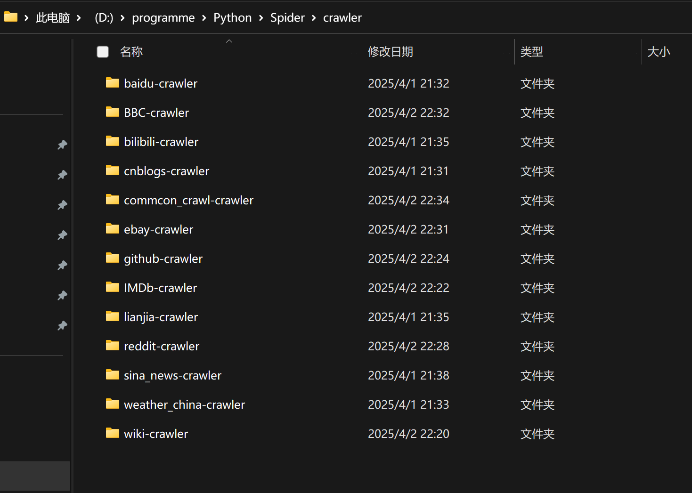
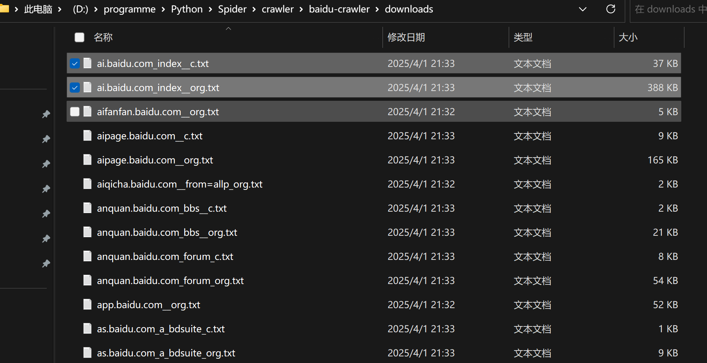
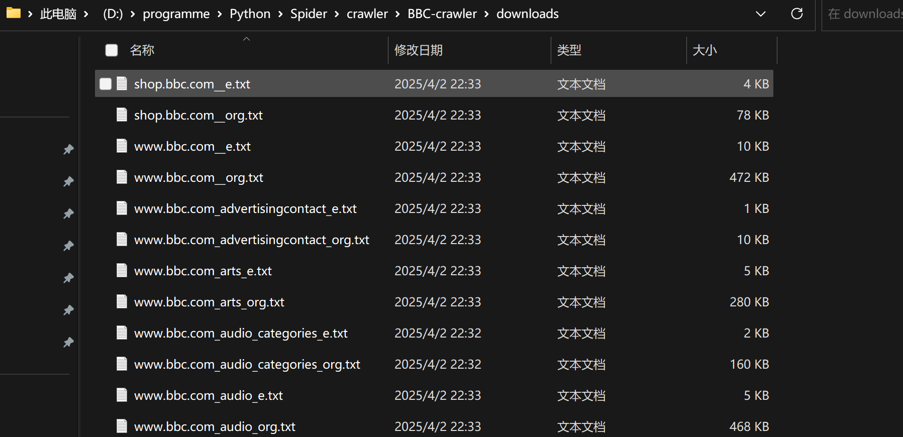

## 功能

- **网页爬取**：支持爬取网页的 HTML 内容，并对其进行解析和处理。
- **多线程支持**：通过多线程技术提升爬取效率。
- **语言支持**：兼容中英文网站的爬取和处理。
- **动态限速**：根据爬取情况动态调整爬取速度，降低被封禁的风险。
- **智能队列管理**：实现队列的智能补充和管理机制。
- **反爬策略**：支持代理配置，绕过常见的反爬机制。
- **内容备份**：自动保存原始网页内容（如：`xxx_org.txt`）。
- **文本预处理**：
  - 删除特殊字符并统一大小写。
  - 中文分词处理。
  - 删除中英文停用词。
  - 英文文本支持 Porter Stemming 词干提取。
- **简化文档生成**：
  - 英文文档处理后保存为简化文件（如：`xxx_e.txt`）。
  - 中文文档处理后保存为简化文件（如：`xxx_c.txt`）。
- **错误处理**：记录爬取失败的 URL，并优雅地处理无法访问的网页。

## 配置&运行

运行前需要安装:

```text
beautifulsoup4 - 用于解析HTML内容
jieba - 用于中文分词
nltk - 用于自然语言处理
fake_useragent - 用于生成随机的User-Agent
requests - 用于发送HTTP请求
requests-html - 用于执行JavaScript渲染
```

可以执行以下命令来安装这些库

`pip install beautifulsoup4 jieba nltk fake_useragent requests requests-html`

<br>

**配置要爬取哪些网站在 configs.py 中修改**

部分网页较好爬取,爬取失败率较低, 爬取速度较快; 部分网页不好爬取,爬取失败率较高, 爬取速度较慢(因此可能会存在 有acb_org.txt文件, 但是没有abc_c.txt文件 的情况)

有的网站无法爬取, 如非必要, 可以换个网站爬取

注意, 部分英文网站可能需要**挂代理**才能爬

<br>

**运行main.py**会生成crawler文件夹, 其下有多个xxx-crawler文件夹, 对应不同的网站



若爬取中文网站, 会生成xxx_org.txt 和 xxx_c.txt文件



若爬取英文网站, 会生成xxx_org.txt 和 xxx_e.txt文件




<br>

## 目录结构

- main.py：主程序入口
- spider.py：爬虫核心逻辑
- domain.py：域名解析工具
- general.py：通用文件操作工具
- link_finder.py：链接解析工具
- configs.py：爬虫配置文件
